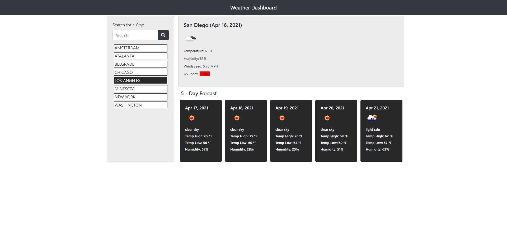

# 06_Weather_Dashboard

UCSD-SD-FSF-PT-03-2021-U-C-MW

## Github repository and published webpage links below

[GitHub link](https://github.com/djony88/06_Weather_Dashboard)

[Published Webpage](https://djony88.github.io/06_Weather_Dashboard/)

Requirements:

* Create weather dashboard with history of searched cities and multiple day forecast.
* When serched for specific city current conditions and for next 5 days are presented and city name is added to search history.
* In serched current weather condition presented are city name, current date, icon presenting current weather condition, temperature, humidity, wind speed and UV index.
* UV index is presented with diferent color wether the conditions are favorable, moderate, or severe.
* Future wether conditions are presented in 5-day forecast that is presented with date, an icon representation of weather conditions, temperature, and humidity.
* When clicked on city from history it presents again the current and future weather conditions for selected city.

HTML:

* Add bootstrap and linked CSS file.
* Added header.
* Added input box for "Search placeholder.
* Added Search button with dark theme.
* City name loaded dynamically in javascript.
* Weather values loaded dynamically in javascript.
* Added 5-day forecast.
* Linked JavaScript file.

CSS:

* Header style.
* Lists in current and forecast.
* Forecast column.
* Current history card.
* Forecast history card.
* Search styling.
* City history sytling.
* Hover option.
* 5-day card header.
* Overall container.

JavaScript:

* Click on Search or City history list (if any).
* Get location from user input in seearch tab or get location from city history (if any).
* Update local storage with new city search. Get current weather for searched location. Get forecast for searched location.
* Convert Unix timestampe to MMM DD, YYYY format function.
* Update City in local storage function. 
* Removes dulicate cities from saved searches.
* Get current user location function. 
* Get latitude and longitude function. 
* Get current conditions for current location and Get forecast for local conditions.
* console.log if browser doesn't support location.
* Get current locaation weather function. Pull city history from local storage memory and Divider for each history location.
* Reset search value to null.
* Set up Open Weather API Query. 
* Open weather API query. Show result into weatherObj. Convert date to usable format = MM/DD/YYYY Format.
* Remove the current forecast. Render the current search city. Render the current search city weather icon. Render the current search city temperature. Render the current search city humidity. Render the current city search wind speed.
* Get UV from open weather using UVI Query
* Initiate API Call to get current weather.
* Open weather call. Show response into UviLevel variable. Initiate background as violet. Determine backgrouind color depending on value. Insert UVI Lable and value into HTML.
* Get weather forecast for selected city. Determining the type of request - If an object, we have lat/lon, use it othervise call API using city name. Set up Open Weather API Query. Open weather API query. Capture lat/lon for subsequent request. Get five days of weather history using longitude and latitude. Initiate API Call to get current weather.
* Open weather API. Load weatherObj from response. Convert date to usable format = MM/DD/YYYY Format. Push day to weatherArr. Show forecast on page. One iteration for each day of forecast history.
* Format HTML UL Tag. Format HTML LI Tags. Format html values. Append HTML. 
* Current location when page opens.

